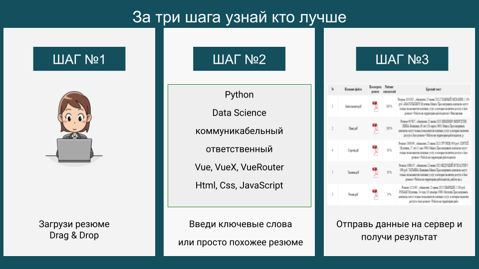
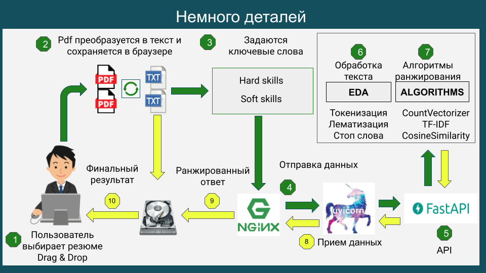

<h1 align="center">✨ CV SCANNER ✨</h1>

  

## ***Навигация***
- [Описание](#описание)
- [Возможные неполадки](#возможные_неполадки)
- [Как пользоваться сервисом](#как_пользоваться)
  - [Архитектура](#архитектура)
  - [Технологии](#Технологии)
- [How to install](#how_to_install)

 
## ***Описание***

Сервис предназначен для ранжирования резюме по заданным ключевым словам.

Демонстрация https://scanercv.3s.by/

 
## ***Возможные неполадки***

При использовании сервиса необходимо использовать только PDF файлы.

 
## ***Как пользоваться сервисом***

- После загрузки всех резюме - пользователь задает ключевые слова, и отправляет запрос на сервер.  

 
### Архитектура

 

 
### Технологии

- [FastApi](https://fastapi.tiangolo.com/)
- [VUE](https://vuejs.org/)

 
## ***How to install***

- Метод №1 (Подходит для разворачивания с помощью Docker):
  - Клонировать репозиторий
  - Выполнить команду docker-compose build
  - Выполнить команду docker-compose up
  - Пререйти по адресу 127.0.0.1:8080

- Метод №2 (local):
  - Клонировать репозиторий
  - Настройка BACKEND
    - Установить python https://www.python.org/
    - Перейти в папку cd backend
    - Установить зависимости pip install -r requirements.txt
    - Запустить файл main.py
    - Должен запуститься webserver на 127.0.0.1:8000
  - Настройка FRONTEND
    - Установить nodejs https://nodejs.org/en
    - Перейти в папку cd frontend
    - Запустить команду npm install
    - Запустить команду npm run dev
    - Должен запуститься webserver на 127.0.0.1:8080